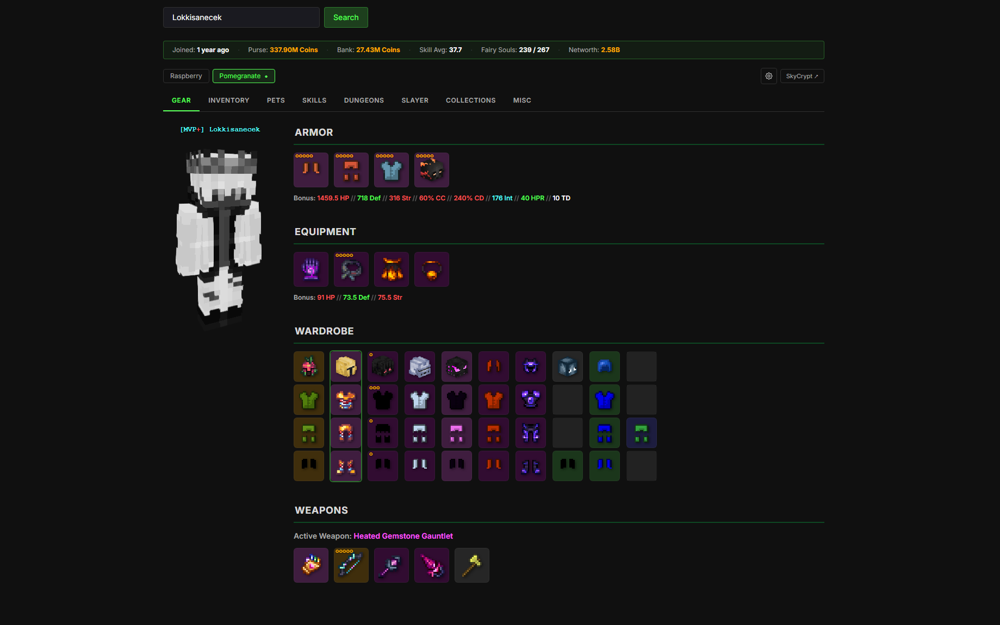

# SkyblockHub

[](https://github.com/Lokkisanek/SkyblockHub.play/releases)
[](https://github.com/Lokkisanek/SkyblockHub.play)
[](https://github.com/Lokkisanek/SkyblockHub.play)

SkyblockHub je moderní, rychlá a rozšiřitelná aplikace pro hráče Hypixel Skyblock. Pomáhá vám dělat lepší obchodní rozhodnutí, šetří čas při hledání party a zvyšuje přehled o vašich investicích.

Proč SkyblockHub?

- Realtime ceny z Bazaaru — okamžité aktualizace přes WebSockets
- Přehledné portfolio a historie nákupů/prodejů
- Nástroje pro crafting arbitráž a BIN alerty
- Matchmaking pro Dungeon Party

Krátce: pokud obchodujete na Hypixel Skyblock, SkyblockHub vám ušetří spoustu kliků a pomůže maximalizovat zisk.

---

Obsah

- [Funkce](#funkce)
- [Ukázka](#ukázka)
- [Tech stack](#tech-stack)
- [Instalace (rychle)](#instalace-rychle)
- [Konfigurace](#konfigurace)
- [Spuštění (vývoj)](#spusteni-vyvoj)
- [Produkce a nasazení](#produkce-a-nasazeni)
- [Tutorial: Jak to zapnout (podrobný)](#tutorial-jak-to-zapnout-podrobny)
- [Přispívání](#prispevani)

---

## Funkce

- `/bazaar` — sledování cen, historie a vývoje
- `Portfolio` — sledování vašich investic a statistik
- `Crafting` — najděte ziskové recepty
- `BIN Sniper` — upozornění na výhodné aukce
- `Dungeon Party` — rychlé hledání hráčů

---

## Ukázka

> Doporučené: přidat screenshot do `public/img/screenshot.png` a odkomentovat níže uvedený řádek.



---

## Tech stack

- Backend: Laravel 11 (PHP 8.2+)
- Frontend: Vue 3 + Inertia.js + Tailwind CSS
- Realtime: Laravel Reverb (WebSockets)
- Databáze: SQLite (lokálně, lze přepnout na MySQL/Postgres)
- Build: Vite

---

## Instalace (rychle)

1. Naklonujte repozitář

```bash
git clone https://github.com/Lokkisanek/SkyblockHub.play.git
cd SkyblockHub.play
```

2. Nainstalujte závislosti

```bash
composer install
npm install
```

3. Vytvořte `.env` a vygenerujte klíč

```bash
cp .env.example .env
php artisan key:generate
```

---

## Konfigurace

Otevřete `.env` a nastavte minimálně připojení k databázi a Discord OAuth:

- `DB_CONNECTION`, `DB_HOST`, `DB_PORT`, `DB_DATABASE`, `DB_USERNAME`, `DB_PASSWORD`
- `DISCORD_CLIENT_ID`, `DISCORD_CLIENT_SECRET`, `DISCORD_REDIRECT_URI`

Příklad lokální redirectu:

```dotenv
DISCORD_REDIRECT_URI=http://localhost:8000/auth/discord/callback
```

---

## Spuštění (vývoj)

Spusťte frontend a backend v oddělených terminálech:

```bash
# Frontend watcher
npm run dev

# Backend webserver
php artisan serve --host=127.0.0.1 --port=8000

# Reverb (WebSockets)
php artisan reverb:start

# Queue worker
php artisan queue:work
```

Otevřete http://localhost:8000

---

## Produkce a nasazení

- Sestavte produkční assets: `npm run build`
- Nasměrujte webserver na složku `public/`
- Použijte process manager (systemd/supervisor) pro `php artisan queue:work` a `php artisan reverb:start`

---

## Tutorial: Jak to zapnout (podrobný)

1) Klonování a závislosti

```bash
git clone https://github.com/Lokkisanek/SkyblockHub.play.git
cd SkyblockHub.play
composer install
npm install
```

2) .env a databáze

```bash
cp .env.example .env
# upravte .env podle potřeby (DB, Discord)
php artisan key:generate
php artisan migrate --seed   # volitelné, pokud chcete sample data
```

3) Spusťte vývojový režim

```bash
npm run dev    # frontend
php artisan serve --host=127.0.0.1 --port=8000
php artisan reverb:start
php artisan queue:work
```

4) Ověřte aplikaci

Otevřete prohlížeč na `http://localhost:8000` a přihlaste se přes Discord (pokud máte nastavené kredenciály). Pokud chcete přidat screenshot do README, umístěte soubor do `public/img/screenshot.png`.

---

## Přispívání

Pokud chcete přispět, otevřete issue nebo pull request. Rád se podívám na nové nápady, bugfixy a vylepšení UX.

---

Pokud chcete, mohu README doplnit o:

- Badge stavu CI / coverage
- Skutečný screenshot přes `public/img/screenshot.png`
- Krátký skript (`setup.sh` / `setup.ps1`) pro rychlé nastavení

Dejte vědět, co přesně chcete přidat nebo upravit.

