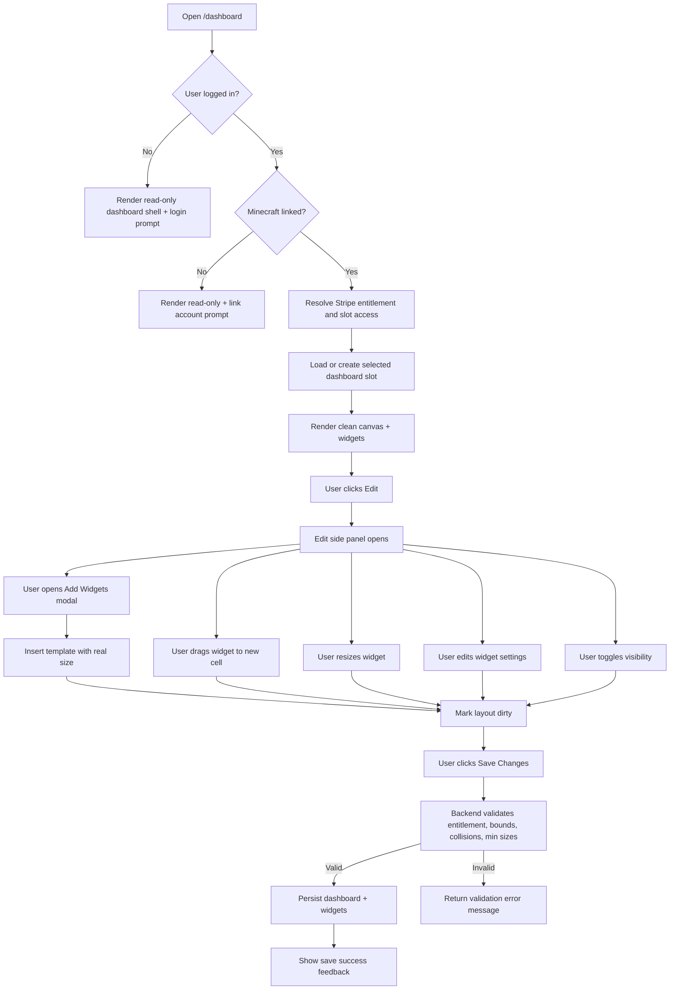

# Dashboard System Specification

## Goal
Create a user-customizable widget dashboard where layout is persisted per account.

## Core Product Rules
- Each user has 1 active dashboard slot available for free.
- Slots 2 and 3 are Stripe-entitlement locked by backend rules.
- Dashboard page is always visible, even when user is not logged in.
- Editing is allowed only when user is logged in and has linked Minecraft account.
- Dashboard supports 10x10 grid placement.
- Widgets are predefined templates in MVP and inserted from the Add Widgets modal.
- Widgets can be dragged and resized with Apple-style smooth motion and subtle haptics.
- Layout is saved only through explicit Save button.
- Dashboard is private by default.
- Public/private toggle exists now for future leaderboard profile visibility.

## Current Widget Templates (MVP)
- Profile Watcher
  - Default size: 4x4
  - Settings: minecraft username, track skin, track skills, track inventory
  - Live data: skin preview, average skill level, used inventory slots
  - Action: open Profile Stats page for configured username
- Profile Stats
  - Default size: 4x4
  - Settings: minecraft username, track skin, track skills, track inventory, track equipment
  - Live data: player summary and optional inventory/skin blocks
- 3D Skin View
  - Default size: 3x5
  - Settings: minecraft username
  - Live data: rotating 3D player model from the linked profile
- Inventory GUI
  - Default size: 5x4
  - Settings: minecraft username, show hotbar
  - Live data: profile inventory grid
- Item Flip Watcher
  - Default size: 4x3
  - Settings: item name
  - Live data: instabuy, instasell, margin from Bazaar DB snapshot
  - Action: open Bazaar Flips page
- Event Timer Watcher
  - Default size: 4x3
  - Settings: event focus name
  - Live data: current mayor and election state snapshot
  - Action: open Event Timer page

## UX Layout Behavior
- Default dashboard view is a clean canvas without visible grid lines.
- Top UI is minimal: title plus Edit button (top right).
- Edit opens an Apple-style side panel with:
  - Add Widgets button
  - Save Changes button
  - Visibility toggle (public/private)
  - Slot status chips (including locked Stripe slots)
- Add Widgets opens a modal popup with available templates and their real widget sizes.
- The dashboard canvas has no visible grid lines in view mode.
- Resize is performed from a corner handle and respects per-widget minimum sizes.

## Access and State Matrix
- Guest user:
  - Can open dashboard page.
  - Sees explanatory message.
  - Cannot add, move, remove, or save widgets.
- Logged-in user without linked Minecraft:
  - Can open dashboard page.
  - Sees linking requirement message.
  - Cannot edit or save.
- Logged-in user with linked Minecraft:
  - Full edit access.
  - Can add widgets, drag and drop, remove widgets, update settings, save.

## Persistence and Validation
### Storage model
- `user_dashboards`
  - `user_id`, `slot_index`, `name`, `is_public`, `grid_columns`, `grid_rows`
- `dashboard_widgets`
  - `user_dashboard_id`, `type`, `title`, `x`, `y`, `w`, `h`, `sort_order`, `settings`
- `user_entitlements`
  - `user_id`, `dashboard_slots_unlocked`, `status`, `provider`, `stripe_customer_id`, `stripe_subscription_id`, `current_period_ends_at`

### Save validation
- Grid bounds are strict (`x + w - 1 <= 10`, `y + h - 1 <= 10`).
- Widgets cannot overlap.
- Widget type must be one of predefined allowed templates.
- Maximum widget count is limited for safety/performance.

## Interaction Flow

## Frontend Behavior Notes
- Drag operation uses a dedicated widget handle.
- Drop placement snaps widget to nearest hidden 10x10 grid cell.
- Resize uses a bottom-right handle and is grid-snapped.
- Save button is in the edit side panel and is disabled unless there are unsaved changes.
- Widget templates are hidden by default and shown only in the Add Widgets modal.
- Public toggle can be changed only for editable state (linked account).

## Future-ready Extensions
- Stripe integration hardening:
  - implement webhook sync to maintain `user_entitlements` automatically
  - reconcile subscription cancellation and grace period logic
- Public dashboard surfacing:
  - expose opt-in dashboards in leaderboard player profiles
  - add read-only public route with privacy checks
- Expanded widget marketplace:
  - keep backend type registry pattern
  - add template metadata and schema-based setting validation

## Things to Improve Next
- Add smarter collision resolution so dragged widgets can snap into a nearest free space instead of being blocked.
- Add save-while-editing autosync after a short debounce for advanced users.
- Add server-side policy class for dashboard permissions to keep controller slimmer.
- Add optimistic UI rollback for save errors.
- Cache profile widget fetches to reduce API load and improve responsiveness.
